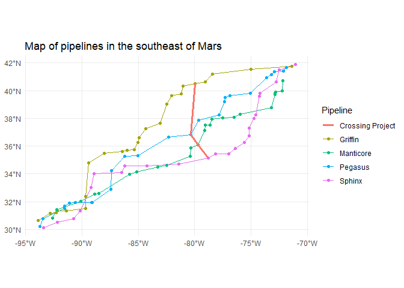

# Natural Gas Planning
Joseph Welsh

## Simulating data

Your writer used R’s inbuilt distribution functions to simulate random x
and y coordinates for different meter points.



    [1] "$1,280,846,131"

``` r
library(ompr)
```

    Warning: package 'ompr' was built under R version 4.4.2

``` r
# network

# n_from = nrow(network_c)
# n_to = ncol(network_c)
# 
# MILPModel() %>% 
#   add_variable(flow[i,j], type = 'continuous', lb = 0,
#                i = 1:n_from, j = 1:n_to) %>% 
#   add_constraint(flow[i,j] <= network_c[i,j], 
#                  i = 1:n_from, j = 1:n_to) %>% 
#   add_constraint(sum_over(flow[i,j], j = 1:n_to) <= supply_c[i,2], 
#                  i = 1:n_from) %>% 
#   add_constraint(sum_over(flow[i,j], i = 1:n_from) == demand_c[j,2],
#                  j = 1:n_to) %>% 
#   set_objective(sum_over(flow[i,j] * cost_c[i,j], 
#                          j = 1:n_to, 
#                          i = 1:n_from),
#                 sense = 'min')
```
