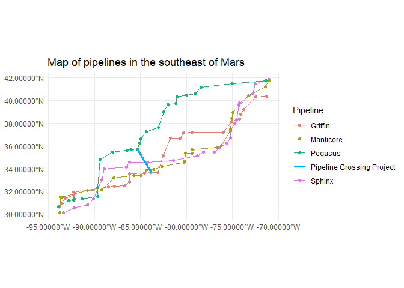

# Natural Gas Planning
Joseph Welsh

## Simulating data

Your writer used R’s inbuilt distribution functions to simulate random x
and y coordinates for different meter points.

``` r
set.seed(9999)
pipelines = 
  tibble(
  Name = c("Sphinx", "Griffin", "Manticore", "Pegasus"), 
  xmin = rep(bbox_coords[1], times = 4),
  ymin = rep(bbox_coords[2], times = 4),
  xmax = rep(bbox_coords[3], times = 4),
  ymax = rep(bbox_coords[4], times = 4)
) %>% rowwise() %>% 
  mutate(data = 
           list(
             genPipelinePoints(Name,
                               x1 = xmin,
                               y1 = ymin,
                               x2 = xmax,
                               y2 = ymax)
             )) %>% 
  select(data) %>% 
  unnest(cols = data) %>% 
  st_as_sf(coords = c('lon', 'lat'),
           crs=4326)
```

``` r
# create pipeline project that unifies 4 points
crossing = 
  pipelines %>% 
  filter(Pipeline %in% c("Pegasus", "Griffin")) %>% 
  group_by(Pipeline) %>% 
  slice_head(n=nrow(.)%/%4) %>% 
  slice_tail(n=1) %>% 
  ungroup() 

crossing_geom = 
  crossing %>% 
  summarize(geometry = st_combine(geometry)) %>% 
  mutate(Pipeline = "Pipeline Crossing Project",
         .before = geometry) %>% st_cast("LINESTRING")


pipelines_geom = pipelines %>% 
  group_by(Pipeline) %>% 
  summarise(geometry = st_combine(geometry)) %>%
  st_cast("LINESTRING")

ggplot() +
  
  geom_sf(data = pipelines_geom,
          aes(color = Pipeline)) +
  geom_sf(data = pipelines, 
          aes(color = Pipeline)) +
  geom_sf(data = crossing_geom, linewidth=1.2,
          aes(color = Pipeline)) +
  ggtitle('Map of pipelines in the southeast of Mars') +
  scale_x_continuous(labels = 
                       scales::label_number(
                         accuracy = .00001,
                         suffix = '°W'
                       )) +
  scale_y_continuous(labels = 
                       scales::label_number(
                         accuracy = .00001,
                         suffix = '°N'
                       )) +
  theme_minimal()
```


