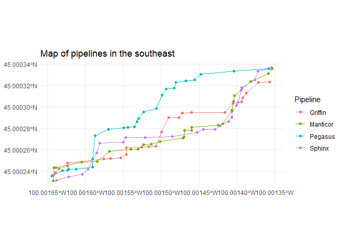

# Natural Gas Planning
Joseph Welsh

## Simulating data

Your writer used R’s inbuilt distribution functions to simulate random x
and y coordinates for different meter points.

``` r
set.seed(9999)

piplines = 
  tibble(
  Name = c("Sphinx", "Griffin", "Manticor", "Pegasus"), 
  xmin = rep(bbox_coords[1], times = 4),
  ymin = rep(bbox_coords[2], times = 4),
  xmax = rep(bbox_coords[3], times = 4),
  ymax = rep(bbox_coords[4], times = 4)
) %>% rowwise() %>% 
  mutate(data = 
           list(
             genPipelinePoints(Name,
                               x1 = xmin,
                               y1 = ymin,
                               x2 = xmax,
                               y2 = ymax)
             )) %>% 
  select(data) %>% 
  unnest(cols = data) %>% 
  st_as_sf(coords = c('lon', 'lat'),
           crs=2163)
```

    Warning in CPL_crs_from_input(x): GDAL Message 1: CRS EPSG:2163 is deprecated.
    Its non-deprecated replacement EPSG:9311 will be used instead. To use the
    original CRS, set the OSR_USE_NON_DEPRECATED configuration option to NO.

``` r
piplines %>% 
  group_by(Pipeline) %>% 
  summarise(geometry = st_combine(geometry)) %>%
  st_cast("LINESTRING") %>% 
  
  ggplot() +
  geom_sf(aes(color = Pipeline)) + 
  geom_sf(data = piplines, 
          aes(color = Pipeline)) +
  ggtitle('Map of pipelines in the southeast') +
  theme_minimal()
```


